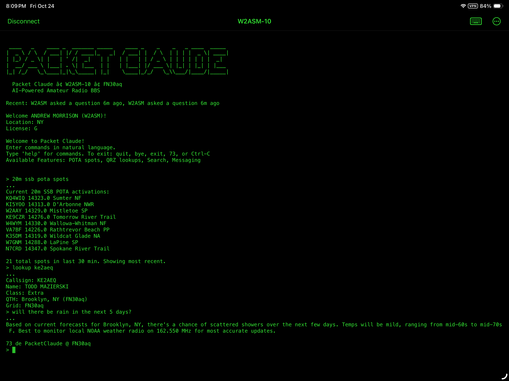

# PacketClaude

An AX.25 packet radio gateway that allows amateur radio operators to interact with Claude AI via VHF/UHF radio using packet radio.

## Overview

PacketClaude creates a packet radio BBS-style node that ham radio operators can connect to using AX.25 packet radio. Once connected, users can have conversations with Claude AI, with context preserved throughout their session.



## Features

- **AX.25 Packet Radio Interface**: Connect via Direwolf software TNC
- **Radio Control**: Integrates with Yaesu FTX-1 via Hamlib for PTT control
- **Multi-user Support**: Handle multiple concurrent connections
- **Session Management**: Per-callsign conversation context
- **Rate Limiting**: Configurable usage limits per callsign
- **Activity Logging**: Complete audit trail of all interactions
- **Graceful Error Handling**: Robust handling of network, API, and radio issues
- **File Transfer via YAPP**: Upload and download files over AX.25 using standard YAPP protocol
- **Classic BBS Games**: Includes Drugwars, Tradewars, Blackjack, Lemonade Stand, and Ham Radio Trivia
- **BBS-Style Interface**: Optimized for low-bandwidth packet radio with terse command responses

## Requirements

- Python 3.11 or higher
- Anthropic API key for Claude access
- A VHF/UHF radio (and a license to operate it)
- Sound card interface or hardware TNC for radio connection
- Direwolf software TNC (configured and running)

## Installation

1. Clone this repository:
```bash
git clone <repository-url>
cd PacketClaude
```

2. Install dependencies:
```bash
pip install -r requirements.txt
```

3. Copy the example configuration:
```bash
cp .env.example .env
cp config/config.yaml.example config/config.yaml
```

4. Edit configuration files with your settings:
- Add your Anthropic API key to `.env`
- Update `config/config.yaml` with your callsign and radio settings

## Configuration

### Main Configuration (`config/config.yaml`)

```yaml
station:
  callsign: "N0CALL-10"  # Your station callsign with SSID
  description: "PacketClaude AI Gateway"

direwolf:
  host: "localhost"
  port: 8001  # Direwolf KISS TCP port

radio:
  enabled: true
  model: "FTX-1"
  device: "/dev/ttyUSB0"
  baud: 4800

claude:
  model: "claude-3-5-sonnet-20241022"
  max_tokens: 500
  temperature: 0.7

rate_limits:
  queries_per_hour: 10
  max_response_chars: 1024
```

### Environment Variables (`.env`)

```
ANTHROPIC_API_KEY=your_api_key_here
LOG_LEVEL=INFO
```

## Usage

1. Ensure Direwolf is running and configured for your radio
2. Start PacketClaude:
```bash
python -m src.packetclaude.main
```

3. Connect from another station using AX.25:
```
connect N0CALL-10
```

4. Once connected, simply type your questions and Claude will respond!

## How It Works

1. **Connection**: User connects to your station via AX.25 packet radio
2. **Authentication**: System validates callsign and checks rate limits
3. **Session Creation**: A new Claude conversation context is created for the callsign
4. **Interaction**: User messages are sent to Claude API, responses are transmitted back
5. **Context Preservation**: Conversation history is maintained for the session duration
6. **File Transfer**: Users can upload/download files via YAPP protocol (see [File Transfer docs](docs/FILE_TRANSFER.md))
7. **Logging**: All interactions are logged with callsign, timestamp, and content
8. **Disconnection**: When user disconnects, session context is cleared

## BBS Features

PacketClaude provides a classic BBS experience optimized for packet radio:

### Games
Users can play classic BBS door games by typing `PLAY <game>` or `GAMES` to list available games:

- **Drugwars** - Classic economics trading game set in NYC
- **Tradewars** - Space trading and combat adventure
- **Lemonade Stand** - Business simulation game
- **Blackjack** - Casino card game
- **Ham Radio Trivia** - Test your amateur radio knowledge

All games are optimized for low bandwidth with single-letter commands and compressed displays.

### Information Services
- Weather lookup (`WX <location>`)
- HF propagation conditions (`PROP`)
- POTA spots (`POTA`)
- DX Cluster spots (`DX <band> <mode>`)
- QRZ callsign lookup (`QTH <callsign>`)
- Grid square calculations (`GRID`, `DIST`)
- Technical reference and calculations

### Messaging & Mail
- Personal mailbox system for users
- Inter-user messaging
- Session-based message storage

### Multi-User Chat
- Real-time chat channels (like CB Simulator or conference mode)
- MAIN public channel plus custom channels
- Shows last 4 messages from past 24 hours when joining
- Lists who's currently online in each channel
- Classic BBS chat experience with /JOIN, /WHO, /CHANNELS commands

### README for Users
A comprehensive `README.txt` file is included in `src/packetclaude/files/` with complete BBS instructions.

To make it available to all users, run:
```bash
python scripts/upload_readme.py
```

This uploads README.txt to the file system as a public file that users can download with `/files public` and `/download <id>`.

## Project Structure

```
PacketClaude/
├── config/             # Configuration files
├── src/packetclaude/   # Main source code
│   ├── ax25/           # AX.25 and KISS protocol handling
│   ├── radio/          # Hamlib radio control
│   ├── claude/         # Claude API integration
│   ├── auth/           # Rate limiting
│   └── logging/        # Activity logging
├── logs/               # Log files
└── data/               # SQLite database
```

## Contributing

Contributions welcome! Please feel free to submit pull requests.

## Disclaimer

This software is for use by licensed amateur radio operators only. Users must comply with all applicable amateur radio regulations in their jurisdiction. The author(s) assume no liability for improper use.

## Support

For issues and questions, please open an issue on GitHub.

73!
